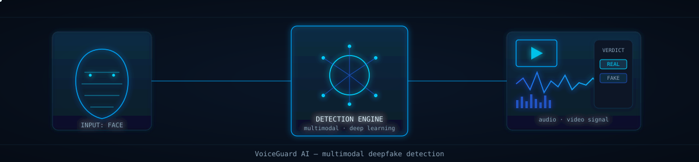
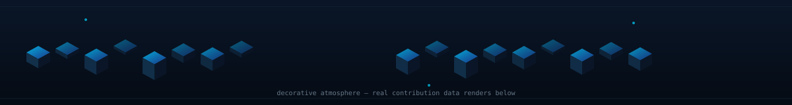

 

# Bharathvaj N.
### AI/ML Developer

 

 

## ⟡ About Me

I'm a **B.Sc Artificial Intelligence & Machine Learning** student at Rathinam College of Arts and Science, building practical, real-world solutions with **Python** and **machine learning**. I'm particularly interested in **AI-powered applications** — from computer vision and audio AI to generative AI and RAG systems — and I enjoy the full arc of a project, from exploring data to shipping something usable.

Outside of ML, I also build full-stack web applications, which keeps my engineering practical and product-focused rather than purely academic.

 

## ⟡ Tech Stack

 

## ⟡ Featured Projects

<table align="center" width="100%" border="0">
<tr><td width="100%">

### 🎯 VoiceGuard AI &nbsp;flagship project

An **AI-powered multimodal deepfake detection** system focused on identifying manipulated audio and video content.

**Stack:** `Python` · `Machine Learning` · `Deep Learning` · `Audio Processing` · `Computer Vision` · `Streamlit`
**Objective:** Detect manipulated audio/video content using a multimodal deep learning approach.

</td></tr>
</table>

 

<table align="center" width="100%" border="0">
<tr>
<td width="50%" valign="top">

**Food Dev**
A full-stack food-related web application.
**Stack:** `JavaScript` · `React` · `Node.js` · `MongoDB`

</td>
<td width="50%" valign="top">

**Handlooms Ecommerce**
An e-commerce web project focused on handloom products.
**Stack:** `JavaScript`

</td>
</tr>
<tr>
<td width="50%" valign="top">

**Student Placement Prediction**
A machine learning project exploring student placement outcomes.
**Stack:** `Java`

</td>
<td width="50%" valign="top">

**CertiGuard AI**
An AI-based certification verification/detection project.
**Stack:** `Python`

</td>
</tr>
<tr>
<td width="50%" valign="top">

**Vistaar Audit**
An in-progress project — repository is newly created with no public code yet.

</td>
<td width="50%" valign="top">

</td>
</tr>
</table>

 

## ⟡ AI / ML Focus

 

 

## ⟡ GitHub Analytics

 

 

> **Note:** these are live stats pulled directly from GitHub's public API by the widgets above — they'll always reflect your real, current activity rather than fixed numbers baked into this file.

 

## ⟡ Contribution Activity

> The top image is a **decorative 3D-style frame** — it does not encode any real data. The animation underneath is your **actual** contribution graph, turned into an animated 2D snake by the `Platane/snk` GitHub Action (`.github/workflows/snake.yml`). Only the snake reflects real GitHub activity.

 

## ⟡ Currently Learning

 

## ⟡ How I Build

<table align="center" width="100%" border="0">
<tr>
<td align="center" width="25%">

**01**
Understand the problem

</td>
<td align="center" width="25%">

**02**
Explore the data

</td>
<td align="center" width="25%">

**03**
Build & evaluate the model

</td>
<td align="center" width="25%">

**04**
Deploy a practical solution

</td>
</tr>
</table>

 

## ⟡ Profile Summary

`AI/ML` · `Python` · `Machine Learning` · `Deep Learning` · `Full Stack Development` · `Data Analysis`

 

## ⟡ Connect With Me

 

